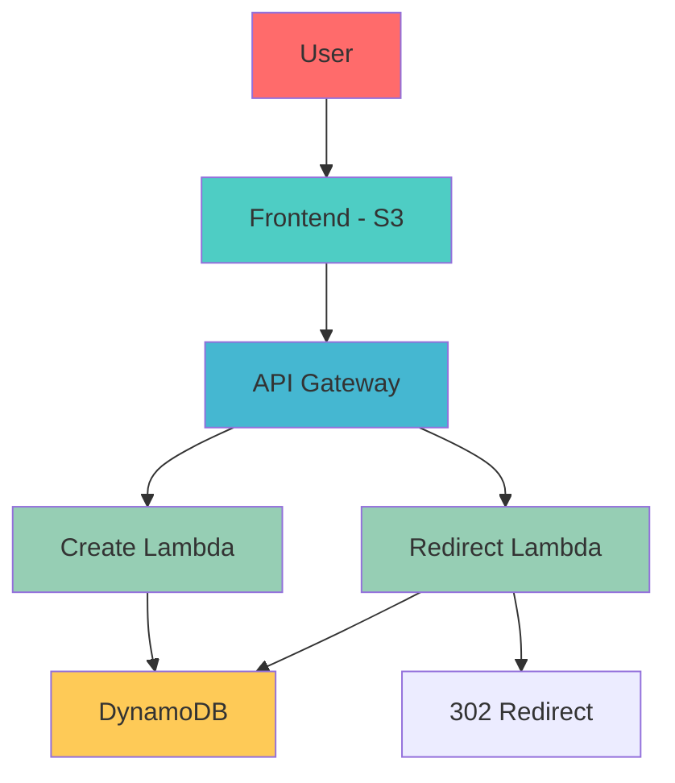

# Serverless URL Shortener - AWS

A production-ready serverless URL shortener built with AWS Lambda, API Gateway, and DynamoDB. Demonstrates full-stack serverless architecture with cost-effective scaling.

## 🏗️ Architecture

